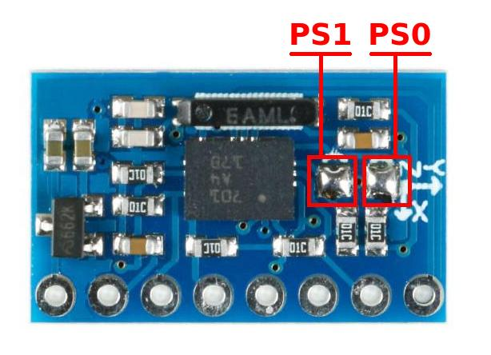
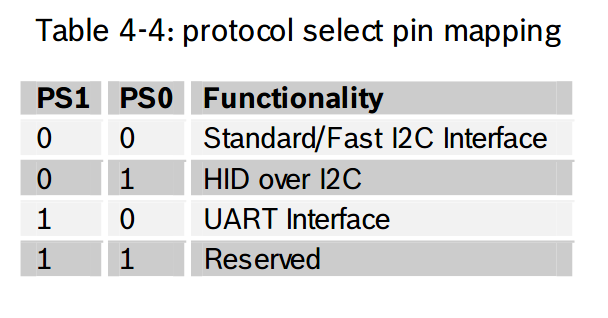
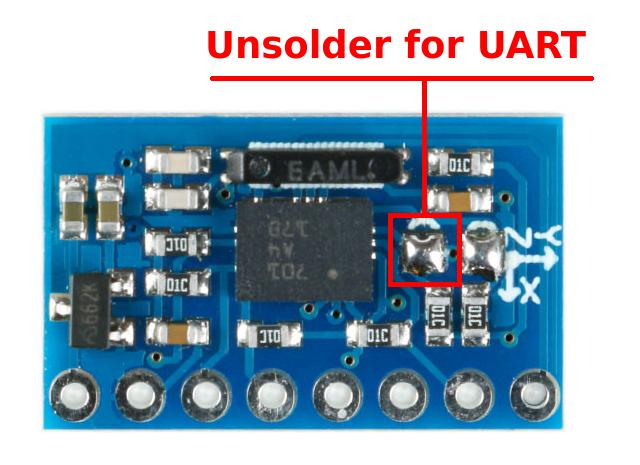

# A BNO05 ROS2 Package

## Description

A ROS2 driver for the sensor IMU Bosch BNO055.

This repo was based off
of [Michael Drwiega's work on the Bosch IMU Driver for ROS 1](https://github.com/mdrwiega/bosch_imu_driver)

---

## Wiring Guide

### Selecting Connection Type

The default mode is I2C.
To select UART mode connect the `3.3V` pin to the `PS1` pin.

### Hardware setup
from  https://github.com/whyscience/ros_imu_bno055

There are different boards that incorporate the BNO055 IMU. The cheapest one is from Aliexpress. This board has two
solder bridges called PS0 and PS1 used to select the type of communication.

On the other hand, on this board the solder bridges are inverted. This means that its state is 1 if the bridge is not
soldered. If the bridge is soldered the state is 0. The table on the left, obtained from the BNO055 datasheet, shows the
communication modes based on PS0 and PS1




**To use the IMU in this package**, it must be configured in **UART mode** to be able to communicate with the serial to
USB converter. Therefore PS0 = 0 and PS1 = 1. Remember that on this board the solder bridges are inverted, so the PS1
bridge must be unsolder.



Finally, connect the IMU to the serial to USB converter. The Rx and Tx cables are crossed. The power of the BNO055
module is 5V

If you are using a different board, for example the Adafruit board or a different Chinese board,
use [this link](https://gr33nonline.wordpress.com/2019/04/19/dont-get-the-wrong-bno055/)

#### 特别注意

1. 对于GY-BNO055，采用上面的方式，断开PS1，连接PS0
2. 但是对于GY-BNO055，是相反的，断开PS0，连接PS1

### CP2104 USB-to-UART Bridge

When using a CP2104 USB-to-UART Bridge:

| BNO055 | CP2104 Friend |
|--------|---------------|
| Vin    | 5V            |
| GND    | GND           |
| SDA    | RXD           |
| SCL    | TXD           |

**NOTE: on the CP2104 the pins above refer to the FTDI pins at the opposite end from the USB connector


---

## ROS Node Parameters

To configure with your own settings please adjust the [node parameter file](bno055/params/bno055_params.yaml) and pass
it
as an argument when starting the node:

```
ros2 run bno055 bno055 --ros-args --params-file ./src/bno055/bno055/params/bno055_params.yaml
```

### UART Connection

- **connection_type=uart**: Defines UART as sensor connection type; default='uart'
- **uart_port**: The UART port to use; default='/dev/ttyUSB0'
- **uart_baudrate**: The baud rate to use; default=115200
- **uart_timeout**: The timeout for UART transmissions in seconds to use; default=0.1

### I2C Connection

- **connection_type=i2c**: Defines I2C as sensor connection type; default='uart'
- **i2c_bus**: The integer I2C bus number to use; default=0
- **i2c_address**: The hexadecimal I2C address to use; default=0x28

### Sensor Configuration

- **frame_id**: coordinate frame id of sensor default='bno055'
- **baudrate**: baudrate of sensor default=115200
- **data_query_frequency**: frequency (HZ) to read and publish data from sensor; default=100 Hz
- **calib_status_frequency**: frequency (HZ) to read and publish calibration status data from sensor; default=0.1 Hz
- **placement_axis_remap**: The sensor placement configuration (Axis remapping) defines the position and orientation of
  the sensor mount.
  See Bosch BNO055 datasheet section "Axis Remap" for valid positions: "P0", "P1" (default), "P2", "P3", "P4", "P5", "
  P6", "P7".

### ROS Topic Prefix

- **ros_topic_prefix**: ROS topic prefix to be used. Will be prepended to the default topic names (see below). Default="
  bno055/"

### Calibration

The current calibration values can be requested via the **calibration_request** service (this puts the imu into *
*CONFIGMODE** for a short time):

```
ros2 service call /imu/calibration_request example_interfaces/srv/Trigger
```

---

## ROS Topics

ROS topics published by this ROS2 Node:

- **imu/data** [(sensor_msgs/Imu)](http://docs.ros.org/api/sensor_msgs/html/msg/Imu.html)
- **imu/data_raw** [(sensor_msgs/Imu)](http://docs.ros.org/api/sensor_msgs/html/msg/Imu.html)
- **imu/temp** [(sensor_msgs/Temperature)](http://docs.ros.org/api/sensor_msgs/html/msg/Temperature.html); The sensor's
  ambient temperature
- **imu/mag** [(sensor_msgs/MagneticField)](http://docs.ros.org/api/sensor_msgs/html/msg/MagneticField.html)
- **imu/grav** [(geometry_msgs/Vector3)](http://docs.ros.org/en/api/geometry_msgs/html/msg/Vector3.html)
- **imu/calib_status** [(std_msgs/String)](http://docs.ros.org/en/api/std_msgs/html/msg/String.html) :
  Sensor Calibration Status as JSON string - e.g. `{"sys": 3, "gyro": 3, "accel": 0, "mag": 3}`

While _bno055_ is the default ROS topic prefix, it can be configured by following the directions above.

---

## Development Workspace Setup

### On a Remote Device

Setup of a ROS2 workspace & IDE for a remote device (for example Raspberry Pi):

#### Clone & Build

Create a ROS2 [workspace](https://index.ros.org/doc/ros2/Tutorials/Workspace/Creating-A-Workspace/) on your remote
device - for instance `~/ros2_ws`

Make sure you sourced your ROS2 installation (underlay).

Then clone the project into your workspace's src directory:

    cd ~/ros2_ws/src
    git clone https://github.com/flynneva/bno055.git

Perform a build of your workspace

    cd ~/ros2_ws
    colcon build

#### Integrate in your IDE

In order to work with the sources in your remote workspace and to integrate them in your IDE, use `sshfs`:

    sudo apt-get install sshfs
    sudo modprobe fuse

Create a IDE project directory and mount the remote ROS2 workspace:

    mkdir -p ~/projects/bno055/ros2_ws
    sshfs ubuntu@192.168.2.153:~/ros2_ws ~/projects/bno055/ros2_ws

Create a new project in your IDE from existing sources in `~/projects/bno055/ros2_ws`.
You can now manipulate the remote ROS2 workspace using your local IDE (including git operations).

### Running the ROS2 node

Run the `bno055` ROS2 node with default parameters:

    # source your local workspace (overlay) in addition to the ROS2 sourcing (underlay):
    source ~/ros2_ws/install/setup.sh
    # run the node:
    ros2 run bno055 bno055

Run with customized parameter file:

    ros2 run bno055 bno055 --ros-args --params-file ./src/bno055/bno055/params/bno055_params.yaml

Run launch file:

    ros2 launch bno055 bno055.launch.py

### Performing flake8 Linting

To perform code linting with [flake8](https://gitlab.com/pycqa/flake8), just perform:

    cd ~/ros2_ws/src/bno055
    ament_flake8

See [www.flake8rules.com](https://www.flake8rules.com/) for more detailed information about flake8 rules.

**Note:** We take advantage of [flake8's noqa mechanisim](https://flake8.pycqa.org/en/3.1.1/user/ignoring-errors.html)
to selectively ignore some errors. Just search for `# noqa:` in the source code to find them.